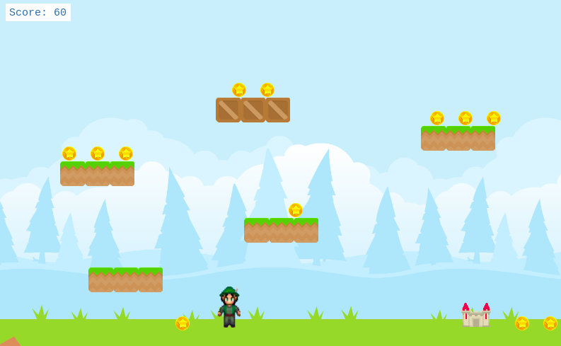

# JS_Capstone_LOS

> This is the Capstone project for Javascript in Microverse Curriculum. It is an RPG game or in other words, it is a traditional platform game like mario or willow. This game is modeled after super mario bros and it consist of two playing level. The player has to collect coins from various platforms by avoiding different obstacles. The main character of the game is "Soha" and player can control the character using the arrow keys in keyboard. There is a possibility of level extension in future.



## How to play

The game can be played using the arrow keys for moving the player. Player can move forward by using the right arrow key and move backward by using the left arrow key. Player can use to up arrow key to jump between the platforms and can collect coin. Player needs to avoid all the spikes,rocks,plants and mushrooms placed on different places. If player lands on these things the game will be over. There are gates that player can use to go to the next level. Player can collect coins and each coin will add 10 points to player's score. The goal of the player is to collect all the coins from two levels without getting killed.

## Built With

- Javascript
- Phaser 3
- Atom text editor
- Stylelint
- Eslint
- Npm
- Webpack
- Jest Tests


## Getting Started

To get a local copy of the repository please run the following commands on your terminal:

```
$ cd <folder>
```

```bash
$ git clone `https://github.com/ajkacca457/JS_Capstone_LOS.git`
$ cd JS_Capstone_LOS
$ open terminal or gitbash
$ run npm install
$ run "npm run start"
$ run your "localhost server"
```

## Testing

To test the project:

```
$ run "npm run test"

```

## Live vesion
[click here]()

## Authors

👤 **Avijit Karmaker**

- Github: [@Avijit](https://github.com/ajkacca457)
- Linkedin:[Avijit Karmaker](https://www.linkedin.com/in/avijit-karmaker-8738a54)

## 🤝 Contributing

Contributions, issues and feature requests are welcome!

## Show your support

Give a ⭐️ if you like this project!

## Copyright
This is a project developed by Microverse Student as the part of skill curriculum.
